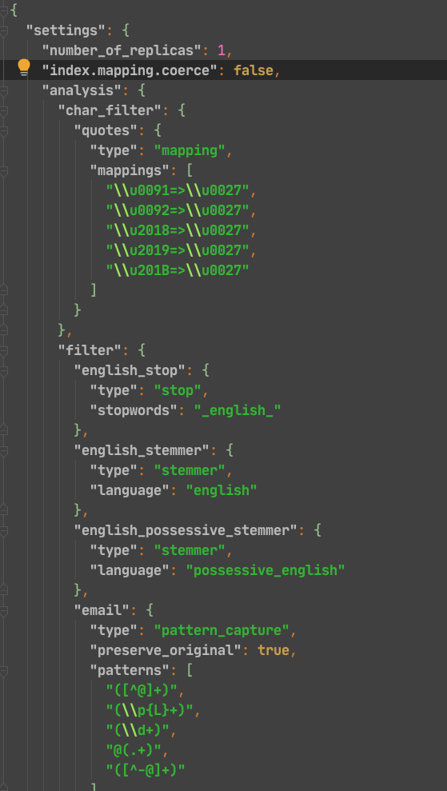

## 核心概念说明

[TOC]

### 集群(cluster)

可以在 config/elasticsearch.yml 文件中配置集群名称

`cluster.name: my_project_cluster`

##### 状态:

- 绿色: 节点运行状态为健康状态, 所有的主分片,副本分片都可以正常工作
- 黄色: 节点运行状态为警告状态, 所有的主分片可以正常工作, 但是至少有一个副本分片是不能正常工作的.
- 红色: 集群无法正常工作.

 

### 索引(index)

索引可以从两个方面来理解

- 名词: 具有相似特征文档的集合
- 动词: 索引数据以及对数据进行索引操作

 

### 类型(type)

类型是索引上的逻辑分类或者分区, 在es6之前, 一个索引允许有多个类型, 从es7开始, 一个索引中, 只能有一个类型, 不建议一个索引有多个类型.

 

### 文档(document)

一个可以被索引的数据单元, 例如一个用户的文档, 一个产品的文档等, 文档都是json数据结构的

 

### 分片(shards)

索引都是存储在节点上的, 但是受限于节点的空间大小以及处理数据的能力, 单个节点的处理效果可能不理想, 此时我们可以对索引进行分片, 当我们创建一个索引的时候, 就需要指定分片的数量, 每个分片本身也是一个功能完善并且独立的索引.

**默认情况下**, 一个索引会自动创建5个分片, 并且为每个分片创建一个副本.

 

##### 副本(repicas)

副本也就是备份, 对主分片的一个备份

 

##### Settings

集群中对索引的定义信息, 例如索引的分片数, 副本数等

 

##### mapping

保存了定义索引字段的存储类型, 分词方式, 是否存储等信息

 

##### alanyzer

字段分词方式的定义

 

##### ElasticSearch VS 关系型数据库

| ES                            | 关系型数据库       |
| ----------------------------- | ------------------ |
| 索引                          | 数据库             |
| 类型                          | 表                 |
| 文档                          | 行                 |
| 字段                          | 列                 |
| 映射(mapping)                 | 表结构             |
| DSL(Domain Specific Language) | SQL                |
| GET http://                   | select * ...       |
| PUT http://                   | update xxx set ... |
| DELETE http://                | delete xxx         |
| 全文索引                      | 索引               |

 

 

 

###### 完 ~