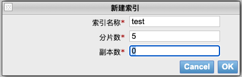
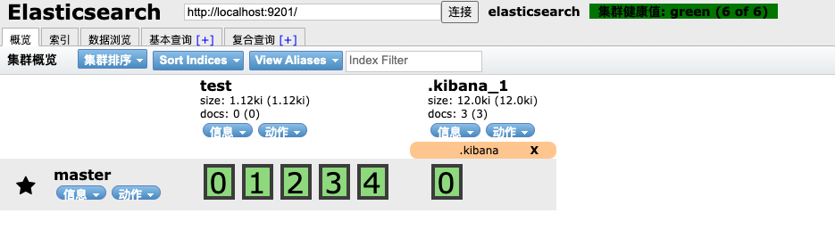
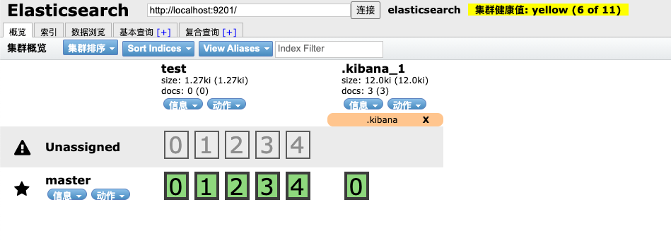
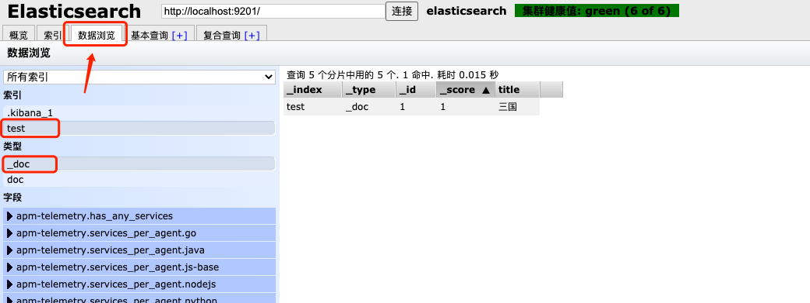

## 索引管理

[TOC]


### 新建索引

通过 head 插件新建索引 test, 因为本地是单节点集群, 所以副本数改为0

- 索引名称不能包含**大写字母**
- 索引名称是唯一的,不能重复



索引创建成功之后:



0,1,2,3,4 表示索引的分片, 没有副本(有副本的情况下, 粗框框表示主分片, 细框框表示副本), kibana索引只有一个分片(设置了副本的情况下, 也会有副本)

<br>

### 更新索引配置

索引创建好之后, 可以修改其属性

例如修改索引的副本数:

```json
PUT test/_settings
{
	"number_of_replicas": 1
}
```

此时, es集群状态显示黄色,因为没有副本节点可以用



例如: 关闭索引的写权限:

关闭写权限之后, 就无法添加文档了, 提示: "reason": "blocked by: [FORBIDDEN/8/index write (api)];"

如果想要再次打开写权限: "blocks.write": false

```json
PUT test/_settings
{
    "blocks.write": true
}
```

其他类似的权限有: 

- blocks.read
- blocks.read_only

<br>

### 查看索引配置信息

查看test索引的配置信息

```json
GET test/_settings
```

也可以同时查看多个索引配置信息

```json
GET test, bak_test/_settings
```

也可以查看所有索引配置信息

```json
GET _all/_settings
```

<br>

### 索引数据

增加数据: 索引创建成功后, 向索引中写入文档

PUT 多次请求会增加数据的version号, 相当于更新当前文档(之前的文档会被标记删除)

```json
PUT test/_doc/1
{
	"title": "三国"
}
```

后面增加 _create ,会提示增加失败(重复代码:409)

```json
PUT test/_doc/1/_create
{
		"title": "三国"
}
```

写入文档成功后, 可以在head插件中查看



<br>

### 复制索引

 只会复制索引数据, 不会复制索引的配置

例如现在的test索引有多余的字段,需要剔除掉, 需要先定义并创建好 dest 索引, 然后再把数据reindex过去

当然, 复制的时候,可以增加查询条件, 将符合条件的数据复制过去.

```json
POST _reindex
{
    "source": {"index": "test"},
    "dest": {"index": "bak_test"}
}
```

调用 reindex 接口，接口将会在 reindex 结束后返回，而接口返回超时只有`30秒`，如果 reindex 时间过长，建议加上`wait_for_completion=false`的参数条件，这样 reindex 将直接返回`taskId`: Ga3kqwzoQxaiyg7ByJmtLg:881891242

在没有设置 `refresh_intervals` 和 `number_of_replicas` 时，reindex 的速度在 500~1000 doc/sec, 如果包含 script 时可能会更低。设置之后，可以到 4000~8000 doc/sec。 Teambition 70M Documents 大概耗时4小时。

可以使用`GET _tasks/{taskID}`可以看到重建进程，其中包含耗时，剩余doc数量等信息。

如果发现错误，可以使用`PUT _tasks/{taskID}/cancel`接口放弃任务，从头再来。

<br>

### 索引别名

可以为索引创建别名, 如果这个别名是唯一的, 该别名可以代替索引名称, 如果别名不唯一, 那么会查询到该别名的所有文档数据.(可同时添加移除多个操作)

移除别名: 将 add --> remove

```json
POST _aliases
{
    "actions":[
        {
            "add": {
                "index": "test",
                "alias": "test_alias"
            }
        }
    ]
}
```

查看test索引的别名

```json
GET test/_alias
```

查看别名test_alias 对应的有哪些索引

```json
GET test_alias/_alias
```

<br>

### 关闭/打开索引

关闭不被使用的索引, 节省资源 (使用PUT请求会提示405状态码)

```json
# 关闭单个索引
POST test/_close

# 关闭多个索引
POST test, bak_test/_close

# 关闭所有索引
POST  _all/_close

# 打开
POST test/_open
```

<br>

### 删除索引

```json
DELETE test
```

<br><br><br>


######  完 ~


