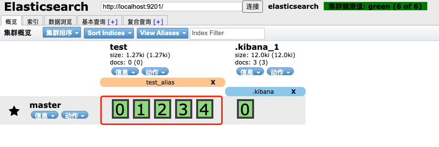

## 文档路由

ES 是一个分布式的存储系统, 当我们存储一个文档到索引时, 这个文档实际上是被存储到 master 节点中的某个主分片上,

例如新建一个索引, 该索引有5个分片, 0个副本: 



接下来向索引中创建一个文档: 

```json
POST test/_doc/1
{ 
    "title": "春秋",
    "auther": "孔子"
}
```

文档创建成功后, 可以查看该文档被保存到哪个主分片上: 

```json
GET _cat/shards/test?v
```

查看结果如下, 发现存储到主分片 3 上: 

```json

index shard prirep state   docs store ip         node
test  1     p      STARTED    0  259b 172.19.0.3 master
test  4     p      STARTED    0  259b 172.19.0.3 master
test  2     p      STARTED    0  262b 172.19.0.3 master
test  3     p      STARTED    1 3.9kb 172.19.0.3 master
test  0     p      STARTED    0  259b 172.19.0.3 master
```

那么 ES 如何知道这个文档被存到哪个分片上? 

> ES 中的路由机制是通过哈希算法, 将具有相同哈希值的文档放到一个主分片中, 分片位置的计算方式如下: 
>
> shard = hash(routing) % number_of_primary_shards

routing 可以是一个任意字符串, es 默认是将文档的id作为routing值, 通过哈希函数根据routing生成一个数字, 然后将该数字和分片数取余, 取余的结果就是分片的位置.

默认的这种路由模式, 最大的优势在于负载均衡, 这种方式可以保证数据平均分配在不同的分片上, 但是他有一个很大的劣势, 就是查询的时候不知掉文档的分片位置, 此时它会将请求广播到所有的分片上去执行(查询的时候显得不是特别高效) 

(2021-02-02 15:09 补充: 单个文档的获取可以根据文档的id来计算出分片位置, mget 会转发请求到每个主分片或副本分片的节点上) [多文档模式](https://www.elastic.co/guide/cn/elasticsearch/guide/current/distrib-multi-doc.html)

当然开发者也可以自定义routing的值:

```json
POST test/_doc/2?routing=abcd
{ 
    "title": "春秋",
    "auther": "孔子"
}
```

如果文档在添加的时候, 指定了 routing值, 则查询, 删除, 更新时也需要指定routing (6.6.2版本不加routing值也能执行操作)

```json
GET test/_doc/2?routing=abcd
```

自定义routing有可能导致负载不均衡, 这个还是要结合实际情况选择

##### 典型场景

对于用户数据, 我们可以将userid作为routing, 这样就能够保证同一个用户的数据保存在同一个分片中, 检索时, 同样使用userid作为routing, 这样就可以精准的从某一个分片中获取数据.

<br><br><br>


###### 完~


