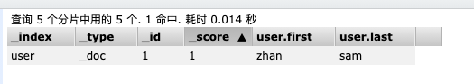

## 字段类型

[toc]


### 核心类型

##### 字符串类型

- string: 这是一个已经过期的类型, 在es5.5之前, 用这个来描述字符串, 现在它已经被text和keyword替代了
- text: 如果一个字段是要被全文检索的, 比如博客内容, 新闻内容,产品描述, 那么可以使用text, 字段内容会被分析, 在生成倒排索引之前, 字符串会被分词器分成一个个的词项, text类型的字段不能用于排序, 很少用于聚合, 这种字符串也被称为 analyzed 字段.
- keyword: 适用于结构化的字段, 例如email, 手机号码, 标签, 文件后缀名, 这种类型的字段可以用于排序, 聚合等, 这种字段也被称为 not_analyzed 字段. 

##### 数字类型

- long
- integer
- short
- byte
- double
- float
- half_float: 16位双精度IEEE754浮点类型
- scaled_float: 缩放类型的浮点字段

在满足需求的情况下, 优先使用范围小的字段, 字段长度越短, 索引和搜索的效率越高

浮点数优先使用 scaled_float

##### 日期类型

由于JSON中没有日期类型, 所以ES中的日期类型形式就比较多样:

- 2021-02-07 或者 2021-02-07 15:15:00
- 一个从1970.1.1零点到现在的一个秒数或者毫秒数, 就是秒级时间戳或毫秒级时间戳

ES内部将时间转换为 UTC, 然后将时间按照 milliseconds-since-epoch 的长整型来存储, 就是UNIX 时间戳.

##### 布尔类型

JSON中的 "true", "false", true, false 都可以

##### 范围类型

- integer_range
- float_range
- long_range
- ip_range

定义索引的时候, 指定范围类型即可

插入文档的时候, 需要指定范围的界限.

##### 二进制数据

二进制接受的是 base64 编码的字符串, 默认不存储也不可搜索

<br>

### 复合类型

##### 数组类型

ES 没有单独的数组类型, 默认情况下, 任何字段都可以有一个或者多个值, 需要注意的是, 数组中的元素必须是同一种类型

添加数组时, 数组中的第一个元素决定了整个数组的类型.

##### 对象类型(object)

由于JSON本身具有层级关系, 所以文档包含内部对象, 内部对象中, 还可以包含内部对象

```json
{
  "title": "春秋",
  "exif": {
    "height": 200,
    "width": 200
  }
}
```

##### 嵌套类型(nested)

是object对象类型中的一个特例:  使用场景: 博客的评论, 点赞用户信息等

如果使用 object 类型, 假如有如下一个文档:

```json
{
  "user": [
          {
              "first": "zhan",
              "last": "sam"
          },
          {
              "first": "li",
              "last": "si"
          }
      ]
}
```

由于 Lucene 没有内部对象的概念, 所以 ES 会将对象层次扁平化, 将一个对象转为字段名和值构成的简单列表进行储存, 即上边的文档, 最终存储形式是: 

```json
{
  "user.first": ["zhan", "li"],
  "user.last": ["sam", "si"]
}
```

扁平化之后, 用户名之间的关系没了, 这样会导致如果搜索 zhan si 这个人, 会搜索到, 这样是不合理的, 所以需要使用 nested 类型, 来保持数组中每个对象的的独立性.

此时使用 nested 类型最终存储形式: 

```json
{
  {
  	"user.first": "zhan", 
 		"user.last": "sam"
	},
	{
  	"user.first": "li", 
 		"user.last": "si"
	},
}
```

**使用 nested 嵌套类型步骤**: 

1. 创建user索引

   ```json
   PUT user
   {   
       "settings": {
           "number_of_replicas": 0
       },
       "mappings": {
           "_doc": {
               "properties": {
                   "user": {
                       "type": "nested", 
                       "properties": {
                           "first": {
                               "type": "keyword"
                           },
                           "last": {
                               "type": "keyword"
                           }
                       }
                   }
               }
           }   
       }
   }
   ```

2. 添加数据

   ```json
   POST user/_doc/1
   {
       "user": [
           {
               "first": "zhan",
               "last": "sam"
           },
           {
               "first": "li",
               "last": "si"
           }
       ]
   }
   ```

   数据索引结果如下:

    

3. 查询语句, 当我们搜索 zhan sam 的时候会搜索到, 搜索 zhan si 的时候搜不到, 这样是合理的

   ```json
   GET/POST user/_doc/_search
   {
       "query": {
           "nested": {
               "path": "user",
               "query": {
                   "bool": {
                      "must": [
                           {
                               "term": {
                                   "user.first": "zhan"
                               }
                           },
                           {
                               "term": {
                                   "user.last": "sam"
                               }
                           }
                       ] 
                   }
               }
           }
       }
   }
   ```

<br>

### 地理类型

使用场景: 

- 查找某一个范围内的地理位置
- 通过地理位置或者相对中心点的距离来聚合文档
- 把距离整合到文档的评分中
- 通过距离对文档进行排序

<br>

### 特殊类型

##### IP地址

存储IP地址, 类型是ip (v4, v6都可以)

创建索引:

```json
PUT blog
{   
    "settings": {
        "number_of_replicas": 0
    },
    "mappings": {
        "_doc": {
            "properties": {
                "address": {
                    "type": "ip"
                }
            }
        }   
    }
}
```

添加文档:

```json
POST blog/_doc/1
{
   "address": "192.168.1.105"
}
```

搜索文档:

```json
GET blog/_doc/_search
{
    "query": {
        "term": {
            "address": "192.168.0.0/16"
        }
    }
}
```

<br>

##### token_count

用于统计字符串分词后的词项数量

创建索引, 定义title字段的length属性为token_count类型: 相当于新增了 title.length 字段用来统计分词后词项的个数.

```json
PUT blog
{   
    "settings": {
        "number_of_replicas": 0
    },
    "mappings": {
        "_doc": {
            "properties": {
                "title": {
                    "type": "text",
                    "fields": {
                        "length": {
                            "type": "token_count",
                            "analyzer": "standard"
                        }
                    }
                }
            }
        }   
    }
}
```

添加文档:

```json
POST blog/_doc/1
{
   "title": "zhan san"
}
```

通过 token_count 的值搜索文档:

```json
GET blog/_doc/_search
{
    "query": {
        "term": {
            "title.length": 2
        }     
    }
}
```

<br><br><br>


###### 完


