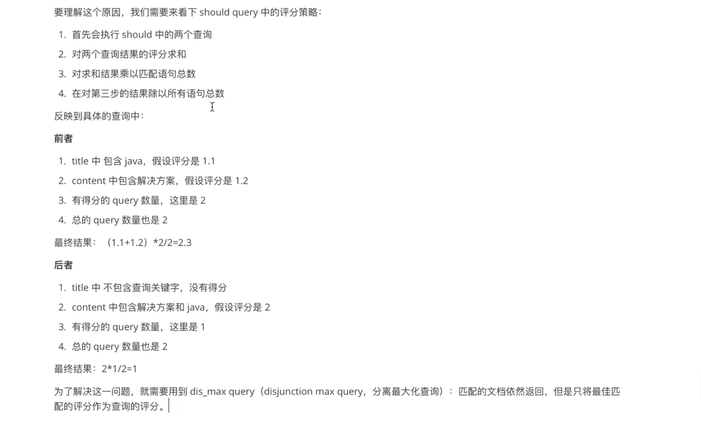

## 组合查询

[toc]

### constant_score

当我们不关心检索词项的频率(TF) 对搜索结果排序的影响时, 可以使用 constant_score 将语句包裹起来.

```json
GET books/_doc/_search
{
  "query": {
    "constant_score": {
      "filter": {
        "term": {
          "name": "java"
        }
      },
      "boost": 1.2
    }
  }
}
```

也可以写成这样: 

~~~json
GET books/_doc/_search
{
  "query": {
    "bool": {
      "filter": {
        "term": {
          "name": "java"
        }
      },
      "boost": 1.2
    }
  }
}
~~~


<br>

### bool

将多个简单查询组合在一起, 有四个关键字可以选择, 四个关键字可以有一个或者多个: 

- must: 文档必须匹配 must 选项下的查询条件
- should: 如果满足这些语句中的任意语句，将增加 `_score` ，否则，无任何影响。它们主要用于修正每个文档的相关性得分。
- must_not: 文档必须**不**匹配 must_not 选项下的查询条件
- filter: 类似于 must, 但是 filter 不评分, 只是过滤数据

> 如果没有 `must` 语句，那么至少需要能够匹配其中的一条 `should` 语句。但，如果存在至少一条 `must` 语句，则对 `should` 语句的匹配没有要求。 [组合多查询](https://www.elastic.co/guide/cn/elasticsearch/guide/current/combining-queries-together.html)

例如查询 name 属性中必须包含 “程序设计”, 同时书的价格不在 0 - 35 区间内, info 属性可以包含 “java”:

```json
GET books/_doc/_search
{
  "query": {
    "bool": {
      "must": [
        {
          "term": {
            "name": "程序设计"
          }
        }
      ],
      "should": {
        "term": {
          "info": "java"
        }
      },
      "filter": {
        "range": {
          "price": {
          "gt": 35  
          }
        }
      }
    }
  }
}
```

在使用 should 时涉及到一个参数: `minimum_should_match` 

该参数在 ES 官网称作最小匹配度, 在之前学习的 multi_match 或这里的 should 查询中, 都可以设置 minimum_should_match 参数的值, 值可以用百分比表示, 比如50%, 75%, 100%.

比如我们要查询 name 字段中包含 “语言程序设计” 的文档: 使用match查询 (任何一个词项被匹配就返回文档)

```json
GET books/_doc/_search
{
  "query": {
    "match": {
      "name": "语言程序设计"
    }
  }
}
```

那么分词后, 用组合查询 should 构造的 term 查询表示, 是这样的: 此时 minimum_should_match 默认为1, 与上面的 match 查询等价

```json
GET books/_doc/_search
{
  "query": {
    "bool": {
      "should": [
        {
          "term": {
            "name": "语言" 
          }
        },
        {
          "term": {
            "name": "程序" 
          }
        },
        {
          "term": {
            "name": "设计" 
          }
        },
        {
          "term": {
            "name": "程序设计" 
          }
        } 
      ]
    }
  }
}
```

调整 match 查询的minimum_should_match的参数:

```json
GET books/_doc/_search
{
  "query": {
    "match": {
      "name": {
        "query":"语言程序设计",
        "minimum_should_match": "100%"
        # "operator": "and" 这样写也可
      }
    }
  }
}

```

那么对应的 should 查询是: 

```json
GET books/_doc/_search
{
  "query": {
    "bool": {
      "should": [
        {
          "term": {
            "name": "语言" 
          }
        },
        {
          "term": {
            "name": "程序" 
          }
        },
        {
          "term": {
            "name": "设计" 
          }
        },
        {
          "term": {
            "name": "程序设计" 
          }
        } 
      ],
      "minimum_should_match": "100%"
    }
  }
}
```

<br>

### dis_max




[江南一点雨](https://www.bilibili.com/video/BV1ft4y1e7tq?p=30&spm_id_from=pageDriver)

<br>


<br><br><br>


###### 完


